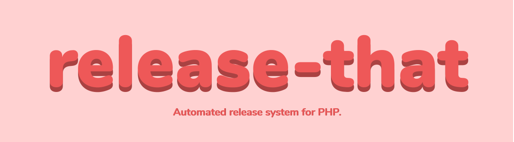

# Release that! :rocket:
* Execute tests, make builds, run anything
* Git commit, tag, push
* Hooks
* Create release in GitHub, GitLab
* Usable in any CI/CD environment (`release-that --ci`)


## Table of contents
* [Introduction](#introduction)
* [Features](#features)
* [Getting started](#getting-started)
* [Configuration](#configuration)
* [Security](#security)
* [Credit](#credits)
* [License](#licensing)


## Introduction

*Moving this project from my ~/stuff, there is a lot to do here.*

*See https://trello.com/b/EUUREZv4/release-that*

### Why
Automated release systems are the key to build consistent packages, i recently built an app with NodeJS, and discovered [Release it](https://github.com/release-it/release-it), and thought that I need the same thing in PHP so here it is.

### How
Release-that binary is distributed as a `.phar` binary and could be used anywhere with PHP 7.3+. The phar is lightweight and has a self-update system to make things as smooth as possible. 

### When
Release-that is useful when publishing a library to ensure things are done right when releasing but could be used for any PHP application that need strict releasing policy although `Release-that` was designed to work with PHP libraries.

## Getting started

Install `release-that` with 
```bash
composer require felixdorn/release-that
``` 
or globally with 
```bash
composer global require felixdorn/release-that
``` 

Next: [Configuration](#configuration)

## Configuration

To create a fresh configuration file, run 
```bash
release-that init
```

You can add a custom name like this 
```bash
release-that init thenonstandardway.json
```

### Supported filenames
* `.release.json`,
* `.release-that`,
* `.release-that.json`,

Each one will take precedence to the one before: `.release-that.json` > `.release-that` > `.release.json`

### Default config
```json
{
    "commit": {
        "message": "chore: release {version}",
        "empty": false,
        "stageAll": true
    },
    "push": {
      "remote": "origin",
      "arguments": ""
    },
    "tag": {
        "name": "{version}",
        "message": "Release Tag {version}"
    },
    "tasks": {
        "beforeAll": "",
        "afterAll": "",
        "beforeRelease": "",
        "afterRelease": "",
        "beforeCommit": "",
        "afterCommit": "",
        "beforeTag": "",
        "afterTag": "",
        "beforePush": "",
        "afterPush": ""
    }
}
```
They are some variables exposed in `commit.message`,`tag.name` and `tag.message` :
* `{version}` The bumped version
* `{date}` The data (Y-m-d) 

## Usage
Once you configured `release-that`, you need to run `release-that run` to release the next version. If you release in CI/CD, there is an option : `--ci`. 

### Hooks
The following variables are exposed in hooks commands.
* `{repo.remote}` 
* `{repo.protocol}` 
* `{repo.pushUrl}`
* `{repo.fetchUrl}`
* `{version}` not available in `beforeAll` and `beforeRelease` 
## Security

If you discover any security related issues, please email github@felixdorn.fr instead of using the issue tracker.

## Credits
* [Félix Dorn](https://felixdorn.fr)

## Licensing
This program is free software: you can redistribute it and/or modify
it under the terms of the GNU General Public License as published by
the Free Software Foundation, either version 3 of the License, or
(at your option) any later version.

This program is distributed in the hope that it will be useful,
but WITHOUT ANY WARRANTY; without even the implied warranty of
MERCHANTABILITY or FITNESS FOR A PARTICULAR PURPOSE.  See the
GNU General Public License for more details.

You should have received a copy of the GNU General Public License
along with this program.  If not, see <https://www.gnu.org/licenses/>

